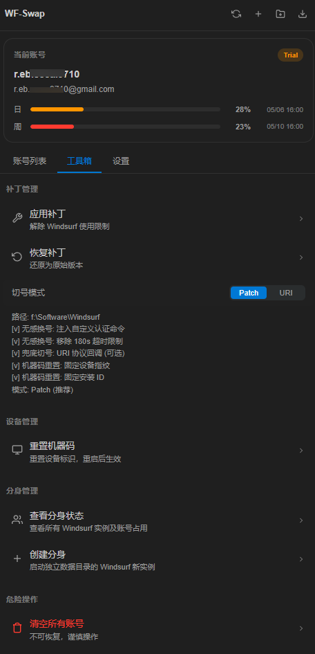
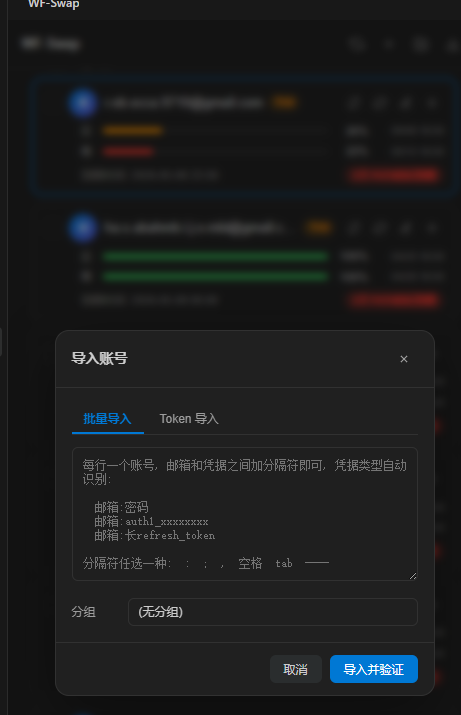
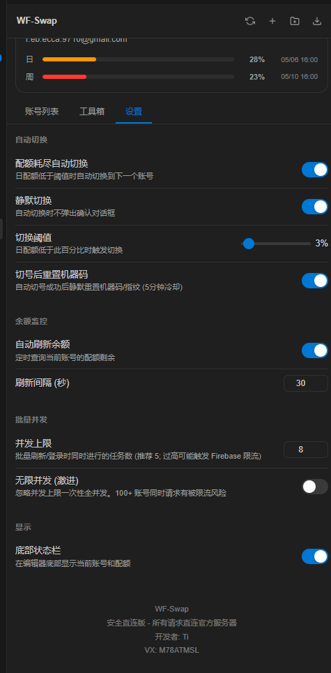

# WF-Swap

Windsurf 多账号管理与一键切换工具。

## 🏠界面预览

### 主界面



### 导入账号



### 设置页



---

## 🚀 快速开始

1. 安装完成后, 在 VS Code / Windsurf 左侧活动栏找到 **WF-Swap** 图标点击打开
2. 点顶栏 **+** 导入你的账号
3. 点卡片上的 **切换图标** 即可把 Windsurf 切到该账号
4. 重启 Windsurf 生效

---

## 📥 导入账号

点顶栏 **+** 按钮, 弹出导入窗口。有两种方式:

### 方式 A: 批量导入 (推荐)

粘贴一堆账号, 每行一个。**凭据类型自动识别**, 无需加前缀:

```
user@example.com:password
user@example.com:auth1_xxxxxxxxxxxxxxx
user@example.com:长refresh_token
```

分隔符任选一种: `:` / `;` / `,` / 空格 / tab / `----`, 例如:

```
user@example.com  password
user@example.com,password
user@example.com----password
```

> 识别规则:
>
> - `auth1_` 开头 → Devin auth1 token
> - 100+ 字符长串 → Firebase refresh_token
> - 其他 → 密码

### 方式 B: Token 导入

如果只有 token 没有密码, 切到 **Token 导入** 标签页:

- **邮箱**: 填任意可识别字符串用于区分账号 (不会校验)
- **凭据类型**:
  - `Devin auth1` - 新版 token (以 `auth1_` 开头)
  - `Firebase refresh_token` - 旧版 token
- **Token**: 粘贴 token 内容

### 💡 立即验证选项

导入弹窗底部有 **立即验证登录** 复选框:

- ✅ **勾选 (默认)**: 导入时就并发登录, 拉取 apiKey / 套餐 / 配额 等信息。推荐开启, 一键看清账号状态。
- ❌ **不勾选**: 只保存账号资料, 后续需要手动点刷新才查询配额。适合账号数量很多或网络不稳定时。

### 分组选择

导入时可以同时指定分组 (下拉里选"新建分组"可即时新建)。

---

## 🔄 切换账号

在账号卡片上点 **切换图标** (箭头循环图标), 弹出确认后:

1. 插件自动停止 Windsurf 进程
2. 写入该账号的登录态到本地
3. 重启 Windsurf 后自动以该账号登录

> 如果当前账号就是要切的那个, 按钮会变成 **重新登录**。

---

## 💰 配额管理

### 单账号刷新

点卡片上的 **刷新图标** (旋转箭头), 图标立刻开始转圈, 刷新完成后自动展示:

- 日配额剩余 / 周配额剩余
- 日重置时间 / 周重置时间
- 套餐名 (Free / Pro / Team...)
- 套餐到期时间 + 剩余天数

### 全量刷新

顶栏 **刷新按钮** → 批量刷新所有账号。按你在设置里配置的并发数跑。

### 排序

账号列表按**套餐到期时间**升序排列, 快到期的排最前, 方便你优先处理。

---

## 🗂️ 分组管理

账号按分组分节显示, 每个分组独立分页, 互不影响。

### 创建分组

导入弹窗的分组下拉里选 **"新建分组"**, 或直接在侧栏操作。

### 重命名 / 删除分组

鼠标悬停在分组标题上, 右边会出现 **✏️ 编辑** 和 **❌ 删除** 按钮。

### 系统分组

- **默认分组** - 未指派分组的账号自动归入, 不可删除

---

## ⚙️ 常用设置

打开 VS Code 设置, 搜 `wfSwitcher`:

- **并发数 (`concurrentLimit`)** - 刷新 / 验证时的并发数, 默认 5
- **无限并发 (`unlimitedConcurrent`)** - 开启后并发数由系统决定 (适合高性能网络)
- **自动切号 (`autoSwitch`)** - 可选, 当前账号配额耗尽时自动切到下一个
- **CF 代理 (`wfSwitcher.cfProxyUrl`)** - 可选, 加速登录 / Firebase 请求

---

## 🔎 搜索 / 筛选

列表顶部搜索框支持按邮箱关键字过滤, 实时生效。

---

## ⌨️ 命令面板

按 `Ctrl+Shift+P` (Mac: `Cmd+Shift+P`), 输入 `WF-Swap`:

| 命令             | 作用                                    |
| ---------------- | --------------------------------------- |
| 打开控制面板     | 在侧栏显示 WF-Swap                      |
| 刷新所有余额     | 批量刷新配额                            |
| 导入账号         | 打开导入弹窗                            |
| 快速切换账号     | 快速选择器里切号                        |
| 切换到下一个账号 | 按列表顺序切到下一个可用账号            |
| 应用补丁         | 应用 Windsurf 切号补丁 (仅初次安装需要) |

---

## ❓ 常见问题

**Q: 导入后卡在"登录验证"?**
A: 已在新版本修复。如果仍出现, 取消勾选 **立即验证登录**, 先只保存账号, 后续手动刷新即可。

**Q: 刷新失败提示"Invalid email or password"?**
A: 该账号只有 token 没有密码, 但对应的 token 已失效。请重新获取最新 token 后使用 **Token 导入** 更新。

**Q: 切号后不生效?**
A: 切号后需要**重启 Windsurf** 才会以新账号登录, 因为登录态是从启动文件读取的。

**Q: 账号卡片显示"未刷新配额"?**
A: 点卡片上的 **刷新图标** 查询一次即可。

---

## 📮 反馈

遇到问题欢迎联系作者 **Ti**。

---

**开发者**: Ti
